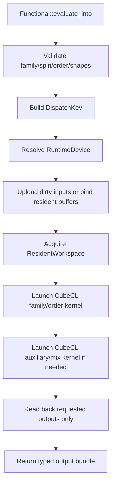
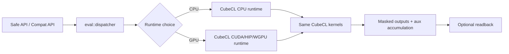
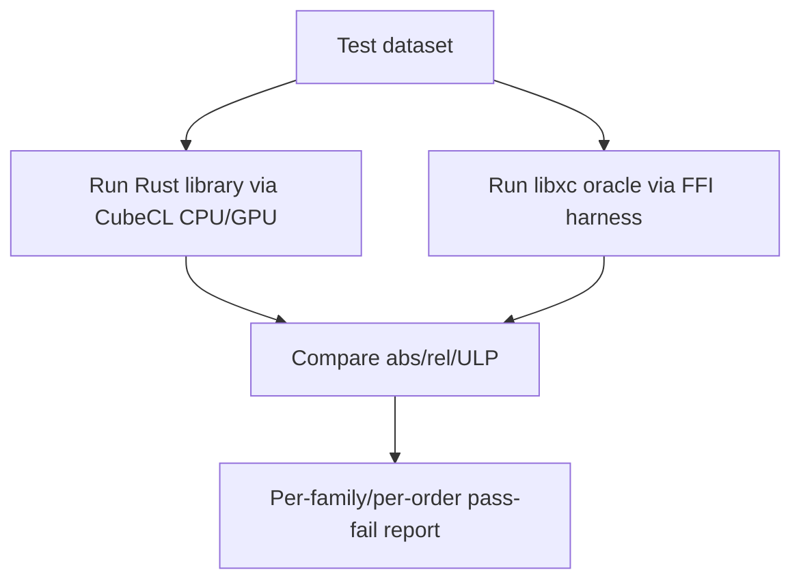

# Detailed Design for Re-architecting the libxc Public API in Rust

> Revision note: this document is an English translation and targeted revision of the previously produced design. The semantic scope is intentionally preserved where possible. The material changes are: **(a)** all numerical evaluation on both CPU and GPU is now required to go through **CubeCL**, **(b)** the source tree is refined to the file level, and **(c)** file responsibilities are specified in more detail.

## 1. Executive Summary

This document defines a from-scratch Rust redesign of the **entire public libxc API surface** found in the supplied `libxc` source bundle, while deliberately **not** copying the original C API verbatim. The redesign keeps full reachability to libxc public capabilities, but exposes them through a safer, more structured Rust API.

The inspected input bundle corresponds to **libxc 7.0.0** (`configure.ac:10` in the bundle). The public surface inventory established from the supplied source tree is:

- **85** public function prototypes in `src/xc.h`
- **649** current public functional ID macros in `src/xc_funcs.h`
- **52** legacy/removed macros in `src/xc_funcs_removed.h`
- **650** registered functional entries in the registry sources (`funcs_key.c` and functional info definitions)
- Family distribution from source parsing: **LDA 72 / GGA 382 / MGGA 196**
- Kind distribution from source parsing: **exchange 222 / correlation 158 / xc 202 / kinetic 68**

### Key architectural revision in this edition

All numerical execution paths — **single-point CPU**, **batch CPU**, **resident CPU**, **single-point GPU**, **batch GPU**, **resident GPU**, and **auxiliary/mixing accumulation** — are required to use **CubeCL kernels**. There is **no separate handwritten CPU evaluator** in this design. CPU execution uses the CubeCL **CPU runtime**, while GPU execution uses CubeCL GPU runtimes (CUDA, HIP, or WGPU/Vulkan/Metal depending on the selected build/runtime path). This unifies the computational semantics and prevents CPU/GPU logic drift.

This direction is technically plausible because CubeCL’s official README lists a **CPU platform/runtime** in addition to GPU targets, and the CubeCL `v0.8.0` release notes explicitly call out an **MLIR-based CPU backend with LLVM**. The same official README also states that CubeCL supports **automatic vectorization**, compile-time specialization, runtime dispatch, and throughput-oriented memory reuse. See the source list in Section 2.

### Three-layer API structure

1. **Low-level compatibility layer**  
   Captures libxc concepts one-for-one where necessary: IDs, legacy naming, packed buffer layout, derivative-order-specific entry points, and C-oriented lifecycle behavior.
2. **Safe core layer**  
   Expresses family, spin, derivative order, input/output shapes, thresholds, external parameters, and metadata as Rust types.
3. **Ergonomic high-level layer**  
   Provides typed evaluation, batch APIs, resident device buffers, explicit output requests, and device/runtime selection.

### Main design conclusions

- **API completeness** is guaranteed by generated registries and a compatibility surface.
- **Safety** is provided by Rust type boundaries and public `thiserror` v2 errors.
- **Performance** comes from CubeCL specialization, output masking, buffer reuse, persistent kernel caches, and minimized host-device transfers.
- **Equivalence to libxc** is judged through an oracle-comparison harness that calls libxc only in the verification toolchain, not in the library runtime.
- **GPU support is first-class**, not deferred.
- **CPU compute also uses CubeCL**, which is the major change in this revision.

This document is a **design specification only**. It contains no production implementation code.

## 2. Investigated Inputs and Assumptions

### 2.1 Primary sources and generated evidence used from the supplied bundle

| Source | Purpose in the investigation | Design impact |
|:--|:--|:--|
| `README.md` | Public usage guidance and supported public headers | Defines visible public boundary |
| `configure.ac` | Version confirmation | Confirms target bundle version |
| `src/xc.h` | Main public header | Defines public functions, public structs, public constants |
| `src/xc_funcs.h` | Current functional IDs | Defines current public functional inventory |
| `src/xc_funcs_removed.h` | Legacy and removed IDs | Drives compatibility/migration design |
| `src/functionals.c` | Functional init/end, threshold, ext-param, registry mechanics | Drives instance lifecycle design |
| `src/func_info.c` | Info getters | Drives metadata access design |
| `src/hybrids.c` | Hybrid metadata behavior | Drives hybrid-domain model |
| `src/mix_func.c` | Auxiliary/mixed functionals | Drives auxiliary-graph model |
| `src/lda.c`, `src/gga.c`, `src/mgga.c` | Family-specific validation and API contracts | Drives family-typed input/output design |
| `src/util.c` | Packed-dimension counting and low-level utilities | Drives shape formulas |
| `testsuite/` | Regression/oracle/finite-difference assets | Drives the validation plan |
| `testsuite/pytest/` | Python-facing behavioral expectations | Drives user-facing expectations and edge cases |
| `/mnt/data/libxc_public_api_inventory.csv` | Generated evidence artifact extracted from `src/xc.h` | Used for coverage and mapping tables |
| `/mnt/data/libxc_functional_inventory.csv` | Generated evidence artifact extracted from the registry sources | Used for counts, family/kind distribution, ext-param coverage |
| `/mnt/data/libxc_legacy_removed_inventory.csv` | Generated evidence artifact extracted from `src/xc_funcs_removed.h` | Used for compatibility strategy |

### 2.2 External sources used for the CubeCL revision

| Source | Relevant evidence | Why it matters |
|:--|:--|:--|
| CubeCL official README (`tracel-ai/cubecl`) | Supported-platform table lists **CPU** plus WebGPU/CUDA/ROCm/Metal/Vulkan; README also describes automatic vectorization, runtime dispatch, and throughput-oriented memory reuse. | Justifies a single CubeCL compute path for both CPU and GPU. |
| CubeCL release notes `v0.8.0` | States that CubeCL introduced a new **MLIR-based CPU backend with LLVM**, plus improved memory management and multi-stream support. | Supports the design decision to require CubeCL CPU runtime instead of a handwritten CPU evaluator. |
| Burn release notes `v0.20.0` | States that CPU and GPU kernels were unified through CubeCL. | Corroborates ecosystem-level feasibility of CPU/GPU kernel unification. |

### 2.3 Assumptions

1. The source bundle is the primary authority for **libxc public API reachability**.
2. The redesigned Rust library does **not** embed libxc for runtime evaluation; libxc is used only by the verification harness.
3. Since this revision mandates CubeCL for all compute, targets where CubeCL CPU runtime or selected GPU runtime is unavailable will return a typed **backend-unavailable** error rather than silently falling back to a non-CubeCL evaluator.
4. `XC_FAMILY_LCA` and `XC_FAMILY_OEP` are retained as forward-compatible public enum variants even though current functional entries were not observed for them in the supplied registry parse.
5. The internal worker ID (`100001`) found in registry parsing remains non-public in the ergonomic API.

### 2.4 Coverage self-check

| Inventory target | Count | Covered in this design | Status |
|:--|--:|:--|:--|
| Public function prototypes in `src/xc.h` | 85 | 85 / 85 | Complete |
| Current functional ID macros in `src/xc_funcs.h` | 649 | 649 / 649 | Complete |
| Legacy / removed macros in `src/xc_funcs_removed.h` | 52 | 52 / 52 | Complete |
| Registered functional entries in `funcs_key.c` + functional infos | 650 | 650 / 650 | Complete |

## 3. libxc Public API Inventory

### 3.1 Public-surface categories

The public surface in `src/xc.h` contains the following categories:

1. Library/version/reference queries
2. Public constants (`spin`, `kind`, `family`, flags, hybrid categories, sentinels)
3. Public C structs (`func_reference_type`, `xc_func_info_type`, `xc_func_type`, family output bundles)
4. Registry and introspection APIs
5. Functional lifecycle APIs
6. Threshold and external-parameter APIs
7. Family-specific evaluation APIs
8. Legacy aggregate evaluation APIs
9. Specialized derivative-order APIs
10. Hybrid/CAM/NLC/auxiliary metadata APIs

### 3.2 Public constants and public types

#### 3.2.1 Core constants

| Category | Public items | Source |
|:--|:--|:--|
| Spin | `XC_UNPOLARIZED`, `XC_POLARIZED` | `src/xc.h:31-32` |
| Relativistic mode | `XC_NON_RELATIVISTIC`, `XC_RELATIVISTIC` | `src/xc.h:34-35` |
| Kind | `XC_EXCHANGE`, `XC_CORRELATION`, `XC_EXCHANGE_CORRELATION`, `XC_KINETIC` | `src/xc.h:37-40` |
| Family | `XC_FAMILY_UNKNOWN`, `XC_FAMILY_LDA`, `XC_FAMILY_GGA`, `XC_FAMILY_MGGA`, `XC_FAMILY_LCA`, `XC_FAMILY_OEP` | `src/xc.h:42-47` |
| Capability flags | `XC_FLAGS_HAVE_EXC`, `...`, `XC_FLAGS_HAVE_ALL`, `XC_FLAGS_NEEDS_LAPLACIAN`, `XC_FLAGS_NEEDS_TAU`, `XC_FLAGS_VV10`, `XC_FLAGS_STABLE`, `XC_FLAGS_DEVELOPMENT`, `XC_FLAGS_1D/2D/3D` | `src/xc.h:49-69` |
| External-parameter sentinel | `XC_EXT_PARAMS_DEFAULT` | `src/xc.h:71-72` |
| Hybrid term types | `XC_HYB_NONE`, `XC_HYB_FOCK`, `XC_HYB_PT2`, `XC_HYB_ERF_SR`, `XC_HYB_YUKAWA_SR`, `XC_HYB_GAUSSIAN_SR` | `src/xc.h:74-91` |
| Hybrid abstract classes | `XC_HYB_SEMILOCAL`, `XC_HYB_HYBRID`, `XC_HYB_CAM`, `XC_HYB_CAMY`, `XC_HYB_CAMG`, `XC_HYB_DOUBLE_HYBRID`, `XC_HYB_MIXTURE` | `src/xc.h:93-100` |
| Reference count limit | `XC_MAX_REFERENCES` | `src/xc.h:102` |

#### 3.2.2 Public structs that must remain reachable

| C type | Meaning | Rust redesign destination |
|:--|:--|:--|
| `func_reference_type` | One bibliographic reference | `meta::Reference` |
| `func_params_type` | External-parameter spec row | `meta::ExtParamSpec` |
| `xc_lda_out_params` | LDA out-struct for order 0..4 | `output::lda::*` and compat bundle |
| `xc_gga_out_params` | GGA out-struct for order 0..4 | `output::gga::*` and compat bundle |
| `xc_mgga_out_params` | MGGA out-struct for order 0..4 | `output::mgga::*` and compat bundle |
| `xc_lda_funcs_variants` / `xc_gga_funcs_variants` / `xc_mgga_funcs_variants` | Dispatch function pointers in C | replaced by generated CubeCL dispatch tables |
| `xc_func_info_type` | Static metadata | `meta::FunctionalMeta` |
| `xc_dimensions` | Packed component counts | `layout::dims` |
| `xc_func_type` | Mutable functional instance | `api::Functional` and `compat::raw_handle` |

### 3.3 Functional inventory characteristics

| Metric | Value | Basis |
|:--|--:|:--|
| Current public functional ID macros | 649 | `/mnt/data/libxc_functional_inventory.csv` + `xc_funcs.h` parse |
| Registered entries | 650 | registry parse |
| `XC_FAMILY_LDA` | 72 | functional inventory |
| `XC_FAMILY_GGA` | 382 | functional inventory |
| `XC_FAMILY_MGGA` | 196 | functional inventory |
| `XC_EXCHANGE` | 222 | functional inventory |
| `XC_CORRELATION` | 158 | functional inventory |
| `XC_EXCHANGE_CORRELATION` | 202 | functional inventory |
| `XC_KINETIC` | 68 | functional inventory |

Additional inventory observations:

| Attribute | Count | Design implication |
|:--|--:|:--|
| Functionals with external parameters | 434 | External parameters are a core feature, not an edge feature. |
| Functionals requiring `tau` | 172 | MGGA inputs must encode `tau` requirements explicitly. |
| Functionals requiring `lapl` | 48 | MGGA validation must reject missing Laplacian data when required. |
| Functionals with VV10/NLC flag | 12 | NLC metadata path must be separate from hybrid metadata. |
| Development-tagged functionals | 16 | The metadata API must expose stability/development markers. |
| Legacy alias macros | 12 | Keep migration support. |
| Case-compatibility alias macros | 12 | Preserve case-compatibility resolution coverage. |
| Removed identifiers | 28 | Must produce typed diagnostics, not silent resolution. |

### 3.4 All 85 public functions

This inventory was corrected against `src/xc.h` so that it now includes the six public APIs that were previously omitted from the metadata and lifecycle groups: `xc_func_info_get_name`, `xc_func_info_get_references`, `xc_func_info_get_ext_params_name`, `xc_func_info_get_ext_params_description`, `xc_func_alloc`, and `xc_func_get_info`.

### 3.5 Version and library reference

| C API | Summary | Rust destination | Source |
|:--|:--|:--|:--|
| `xc_reference` | Library citation and version information | `meta::library::{reference, version}` | `src/xc.h:17-17` |
| `xc_reference_doi` | Library citation and version information | `meta::library::{reference, version}` | `src/xc.h:19-19` |
| `xc_reference_key` | Library citation and version information | `meta::library::{reference, version}` | `src/xc.h:21-21` |
| `xc_version` | Library citation and version information | `meta::library::{reference, version}` | `src/xc.h:24-24` |
| `xc_version_string` | Library citation and version information | `meta::library::{reference, version}` | `src/xc.h:26-26` |

### 3.6 Reference getters

| C API | Summary | Rust destination | Source |
|:--|:--|:--|:--|
| `xc_func_reference_get_ref` | Reference metadata access | `meta::Reference` | `src/xc.h:177-177` |
| `xc_func_reference_get_doi` | Reference metadata access | `meta::Reference` | `src/xc.h:178-178` |
| `xc_func_reference_get_bibtex` | Reference metadata access | `meta::Reference` | `src/xc.h:179-179` |
| `xc_func_reference_get_key` | Reference metadata access | `meta::Reference` | `src/xc.h:180-180` |

### 3.7 Functional metadata getters

| C API | Summary | Rust destination | Source |
|:--|:--|:--|:--|
| `xc_func_info_get_number` | Static functional metadata access | `meta::FunctionalMeta` | `src/xc.h:305-305` |
| `xc_func_info_get_kind` | Static functional metadata access | `meta::FunctionalMeta` | `src/xc.h:306-306` |
| `xc_func_info_get_name` | Static functional metadata access | `meta::FunctionalMeta` | `src/xc.h:307-307` |
| `xc_func_info_get_family` | Static functional metadata access | `meta::FunctionalMeta` | `src/xc.h:308-308` |
| `xc_func_info_get_flags` | Static functional metadata access | `meta::FunctionalMeta` | `src/xc.h:309-309` |
| `xc_func_info_get_references` | Static functional metadata access | `meta::FunctionalMeta` | `src/xc.h:310-310` |
| `xc_func_info_get_n_ext_params` | Static functional metadata access | `meta::FunctionalMeta` | `src/xc.h:313-313` |
| `xc_func_info_get_ext_params_name` | Static functional metadata access | `meta::FunctionalMeta` | `src/xc.h:314-314` |
| `xc_func_info_get_ext_params_description` | Static functional metadata access | `meta::FunctionalMeta` | `src/xc.h:315-315` |
| `xc_func_info_get_ext_params_default_value` | Static functional metadata access | `meta::FunctionalMeta` | `src/xc.h:316-316` |

### 3.8 Registry and introspection

| C API | Summary | Rust destination | Source |
|:--|:--|:--|:--|
| `xc_functional_get_number` | Name ↔ ID resolution | `registry::Registry` | `src/xc.h:370-370` |
| `xc_functional_get_name` | Name ↔ ID resolution | `registry::Registry` | `src/xc.h:372-372` |
| `xc_family_from_id` | ID → family classification | `registry::Registry` | `src/xc.h:374-374` |
| `xc_number_of_functionals` | Registry enumeration | `registry::Registry` | `src/xc.h:377-377` |
| `xc_maximum_name_length` | Registry enumeration | `registry::Registry` | `src/xc.h:379-379` |
| `xc_available_functional_numbers` | Registry enumeration | `registry::Registry` | `src/xc.h:381-381` |
| `xc_available_functional_numbers_by_name` | Registry enumeration | `registry::Registry` | `src/xc.h:384-384` |
| `xc_available_functional_names` | Registry enumeration | `registry::Registry` | `src/xc.h:387-387` |

### 3.9 Lifecycle

| C API | Summary | Rust destination | Source |
|:--|:--|:--|:--|
| `xc_func_alloc` | Instance allocation / initialization / teardown | `compat::raw_handle::RawHandle / api::Functional` | `src/xc.h:390-390` |
| `xc_func_init` | Instance allocation / initialization / teardown | `compat::raw_handle::RawHandle / api::Functional` | `src/xc.h:392-392` |
| `xc_func_end` | Instance allocation / initialization / teardown | `compat::raw_handle::RawHandle / api::Functional` | `src/xc.h:394-394` |
| `xc_func_free` | Instance allocation / initialization / teardown | `compat::raw_handle::RawHandle / api::Functional` | `src/xc.h:396-396` |
| `xc_func_get_info` | Instance allocation / initialization / teardown | `compat::raw_handle::RawHandle / api::Functional` | `src/xc.h:398-398` |

### 3.10 Instance configuration and external parameters

| C API | Summary | Rust destination | Source |
|:--|:--|:--|:--|
| `xc_func_set_dens_threshold` | Threshold and external parameter configuration | `api::Functional / api::builder::FunctionalBuilder` | `src/xc.h:401-401` |
| `xc_func_set_zeta_threshold` | Threshold and external parameter configuration | `api::Functional / api::builder::FunctionalBuilder` | `src/xc.h:403-403` |
| `xc_func_set_sigma_threshold` | Threshold and external parameter configuration | `api::Functional / api::builder::FunctionalBuilder` | `src/xc.h:405-405` |
| `xc_func_set_tau_threshold` | Threshold and external parameter configuration | `api::Functional / api::builder::FunctionalBuilder` | `src/xc.h:407-407` |
| `xc_func_set_ext_params` | Threshold and external parameter configuration | `api::Functional / api::builder::FunctionalBuilder` | `src/xc.h:410-410` |
| `xc_func_get_ext_params` | Threshold and external parameter configuration | `api::Functional / api::builder::FunctionalBuilder` | `src/xc.h:412-412` |
| `xc_func_set_ext_params_name` | Threshold and external parameter configuration | `api::Functional / api::builder::FunctionalBuilder` | `src/xc.h:414-414` |
| `xc_func_get_ext_params_name` | Threshold and external parameter configuration | `api::Functional / api::builder::FunctionalBuilder` | `src/xc.h:416-416` |
| `xc_func_get_ext_params_value` | Threshold and external parameter configuration | `api::Functional / api::builder::FunctionalBuilder` | `src/xc.h:418-418` |

## 4. Fundamental Rust Redesign Principles

### 4.1 Compatibility principle

The Rust library must not merely transliterate the C header. Instead:

- every public libxc capability must remain reachable,
- unsafe pointer-driven usage must be replaced with typed views in the safe layer,
- the compatibility layer must remain sufficient to mirror legacy libxc concepts,
- the ergonomic layer must expose a Rust-native API for typed inputs, typed outputs, batch execution, and resident execution.

### 4.2 Compute unification principle: CubeCL only

This revision replaces the prior split between native CPU evaluation and CubeCL GPU evaluation.

**New rule:** every numerical evaluation path must use **CubeCL kernels**.

That includes:

- scalar/single-point LDA/GGA/MGGA evaluation on CPU,
- batch evaluation on CPU,
- scalar/batch/resident evaluation on GPU,
- auxiliary-functional evaluation,
- mixture accumulation,
- output masking and zero-skip write logic performed inside compute kernels.

What may still run on the host without CubeCL:

- ID/name lookup,
- metadata access,
- builder validation,
- shape validation,
- dirty-range tracking,
- kernel-cache lookup,
- launch orchestration,
- optional post-readback structural checks.

### 4.3 Safety principle

- Public APIs never expose raw mutable pointer arithmetic.
- Public errors are typed (`thiserror` v2).
- Unsafe is confined to FFI verification tools, compat raw-handle internals, and low-level CubeCL launch bridging.
- Family and derivative-order mismatches are rejected before launch.

### 4.4 Performance principle

- Static metadata is generated at build time.
- Dispatch specialization is decided before the hot loop.
- Outputs are masked so unused derivatives are not computed or written.
- Repeated evaluations reuse host scratch, device scratch, resident inputs, and resident outputs.
- CPU and GPU share one kernel family, which reduces semantic drift and duplicated optimization effort.

### 4.5 Validation principle

libxc remains the oracle. Every current public functional must be comparable against libxc at the derivative orders supported by that functional, for both polarized and unpolarized modes, and across CPU/GPU CubeCL runtimes.

## 5. API Mapping Table (libxc → Rust)

| libxc concept / API cluster | Rust layer | Mapping | Notes |
|:--|:--|:--|:--|
| Function IDs in `xc_funcs.h` | `registry` + `meta` | 1:1 | All current public IDs preserved as generated constants and metadata rows. |
| Legacy aliases / removed IDs | `compat::ids`, `registry::legacy`, `compat::removed` | 1:n | Old spellings resolve or fail with typed diagnostics. |
| `xc_func_type` lifecycle | `api::Functional`, `api::builder`, `compat::raw_handle` | 1:n | Safe layer hides manual free/end, compat layer still models handle lifecycle. |
| `xc_func_info_type` getters | `meta::FunctionalMeta` | n:1 | Static metadata grouped into a richer immutable descriptor. |
| Threshold setters | `FunctionalBuilder`, `Functional::set_*_threshold` | 1:n | Same semantics, stronger validation. |
| External parameter APIs | `ExtParamSpec`, builder setters/getters | 1:n | Name/index lookups remain possible without exposing raw pointers. |
| Family evaluation (`xc_lda_new`, `xc_gga_new`) | `Functional::evaluate_into` + family-specific bundles | 1:n | One safe entry point plus family-specific types. |
| Legacy aggregate eval APIs | `compat::legacy_eval::*` | 1:1 at compat layer | Preserved for completeness; implemented through the same CubeCL dispatch path. |
| Specialized derivative APIs | `DerivativeOrder` + output masks + compat shims | n:1 | Safe layer makes derivative order explicit. |
| Hybrid/CAM/NLC/Aux APIs | `meta::hybrid`, `meta::nlc`, `meta::auxiliary` | n:1 | Returned as typed metadata instead of scattered scalar getters. |
| CPU/GPU execution | `runtime` + `kernel` + `api::resident` | n:1 | All numerical compute goes through CubeCL; runtime choice changes only launch/runtime policy. |

## 6. Domain Model / Data Structure Design

### 6.1 Core domain types

```text
FunctionalId
Family
Kind
Spin
DerivativeOrder
CapabilityFlags
Thresholds
PrecisionPolicy
FeatureRequirements
FunctionalMeta
Reference
ExtParamSpec
HybridDescriptor
NlcDescriptor
AuxiliaryGraph
Functional
BatchRequest
ResidentBatch
RuntimeDevice
DispatchKey
```

### 6.2 Type definitions (design-level pseudocode)

```text
FunctionalId(u32)

Family = Unknown | Lda | Gga | Mgga | Lca | Oep
Kind = Exchange | Correlation | ExchangeCorrelation | Kinetic
Spin = Unpolarized | Polarized
DerivativeOrder = Exc | Vxc | Fxc | Kxc | Lxc

Thresholds { dens, zeta, sigma, tau }
PrecisionPolicy = StrictF64 | RelaxedF64 | OptionalF32 | Mixed

FeatureRequirements {
  needs_sigma: bool,
  needs_lapl: bool,
  needs_tau: bool,
  has_vv10: bool,
  max_order: DerivativeOrder,
}

FunctionalMeta {
  id: FunctionalId,
  canonical_name: &'static str,
  family: Family,
  kind: Kind,
  flags: CapabilityFlags,
  thresholds_default: Thresholds,
  ext_params: &'static [ExtParamSpec],
  references: &'static [Reference],
  hybrid: Option<HybridDescriptor>,
  nlc: Option<NlcDescriptor>,
  auxiliary: Option<AuxiliaryGraph>,
  feature_requirements: FeatureRequirements,
}

Functional {
  meta: &'static FunctionalMeta,
  spin: Spin,
  thresholds: Thresholds,
  ext_params: SmallVec<[f64; 8]>,
  runtime_binding: RuntimeBinding,
}
```

### 6.3 Family-specific input model

| Family | Required fields | Optional fields | Rust input type |
|:--|:--|:--|:--|
| LDA | `rho` | none | `input::lda::LdaInput` |
| GGA | `rho`, `sigma` | none | `input::gga::GgaInput` |
| MGGA | `rho`, `sigma` | `lapl`, `tau` depending on flags | `input::mgga::MggaInput` |

Design rule:

- `MGGA` input cannot be represented as a single blindly accepted blob.
- `FeatureRequirements` derived from metadata decide whether `lapl` and/or `tau` are mandatory.
- The validator rejects missing mandatory channels before any CubeCL launch.

### 6.4 Spin model

- `Spin::Unpolarized` maps to one density lane.
- `Spin::Polarized` maps to the libxc-compatible polarized layout.
- Spin lane counts are available from `model::spin` and shape formulas in `layout::dims`.
- Kernel-side spin packing/unpacking is centralized in `kernel/shared/spin.rs` to keep CPU and GPU runtime semantics identical.

### 6.5 Output model

The safe API uses **requested-output bundles** rather than implicit “everything maybe present” pointers.

```text
LdaOutputs<'a>
GgaOutputs<'a>
MggaOutputs<'a>
OutputRequest
ResidentOutputBuffer
```

Each output bundle:

- borrows caller-owned output slices,
- knows its derivative order ceiling,
- exposes an output mask to the dispatcher,
- computes only requested components,
- never allocates hidden large derivative arrays.

### 6.6 Metadata model

Metadata is split into immutable static and mutable instance state.

- immutable: ID, name, family, kind, flags, defaults, references, hybrid descriptors, NLC descriptors, auxiliary graph, supported derivative mask,
- mutable: spin, thresholds, current ext param values, runtime binding preference.

This minimizes per-instance memory and makes registry data shareable as `'static`.

### 6.7 Backend/runtime model

```text
RuntimeDevice
RuntimeBinding
ResidentBatch
DeviceFunctional
ResidentInputBuffer
ResidentOutputBuffer
ResidentWorkspace
DispatchKey
```

`RuntimeDevice` identifies one CubeCL runtime + device pair.

Examples:

- CubeCL CPU runtime
- CubeCL CUDA runtime
- CubeCL HIP runtime
- CubeCL WGPU runtime (including Vulkan/Metal-capable path depending on runtime/platform)

## 7. Module Decomposition

### 7.1 High-level decomposition

| Module | Purpose |
|:--|:--|
| `api` | Stable public Rust API |
| `compat` | Libxc-concept compatibility layer |
| `meta` | Static metadata and bibliographic/reference access |
| `registry` | ID/name lookup and inventories |
| `model` | Core enums, flags, thresholds, precision policies |
| `layout` | Packed/strided/SoA layout and shape rules |
| `input` / `output` | Typed family-specific I/O bundles |
| `workspace` | Scratch planning and buffer reuse |
| `runtime` | CubeCL runtime/device adapters and caches |
| `kernel` | All numerical kernels, shared between CPU and GPU through CubeCL |
| `eval` | Launch orchestration and policy |
| `error` | Public/internal/FFI error boundaries |
| `generated` | Build-generated registries and dispatch tables |
| `xtask` | Source parsing and code generation |
| `verify` | Oracle comparison tools using libxc FFI |
| `tests` / `benches` | Quality gates |

### 7.2 Hard separation rules

1. `kernel/*` contains **all numerical formulas**.
2. `runtime/*` contains runtime-specific launch and capability logic but **no libxc formula code**.
3. `eval/*` orchestrates validation, upload, launch, and readback; it does **not** contain formulas.
4. `compat/*` mirrors C entry points but delegates compute to the same `eval` path.
5. `verify/*` is the only place allowed to call libxc directly.

## 8. Responsibilities of Each Module

### 8.1 Public API modules

- `api::functional`: safe functional lifecycle and evaluate APIs.
- `api::builder`: strongly typed builder that front-loads misconfiguration errors.
- `api::batch`: borrowed batch evaluation.
- `api::resident`: resident device execution and dirty-range management.
- `api::meta`: metadata convenience layer.

### 8.2 Compatibility modules

- preserve full reachability to libxc public behavior,
- provide legacy aggregate and derivative-order entry points,
- retain current and legacy IDs,
- report removed IDs with typed failures rather than segfault-prone behavior.

### 8.3 Kernel modules

- implement family/order kernels in CubeCL,
- centralize threshold logic,
- centralize spin packing,
- centralize auxiliary accumulation,
- isolate specialization knobs by dispatch key.

### 8.4 Runtime modules

- create/access CubeCL devices,
- probe capabilities,
- manage streams/queues,
- manage persistent caches,
- expose a common runtime trait/object to `eval`.

### 8.5 Verification and benchmark modules

- compare against libxc,
- collect absolute/relative/ULP metrics,
- emit regression reports,
- track performance regressions separately from numerical regressions.

## 9. Processing Flows

### 9.1 Functional construction flow

1. Resolve functional by ID or name.
2. Load `FunctionalMeta` from generated registry.
3. Validate spin selection.
4. Materialize instance thresholds (defaults or overrides).
5. Materialize current ext param values.
6. Bind runtime selection policy (deferred or explicit device).
7. Return immutable-metadata + mutable-instance `Functional`.

### 9.2 Host batch evaluation flow

1. Accept typed input bundle and output bundle.
2. Validate family match, spin shape, derivative-order request, and required channels.
3. Compute `DispatchKey`.
4. Determine whether inputs are already resident; if not, upload via CubeCL runtime.
5. Allocate/reuse resident workspace.
6. Launch CubeCL kernel(s).
7. Read back only requested outputs if caller requested host results.
8. Materialize borrowed output views.

### 9.3 Resident evaluation flow

1. Create `ResidentBatch` bound to one `RuntimeDevice`.
2. Upload `DeviceFunctional` once.
3. Upload input buffers once; track dirty ranges.
4. Repeatedly update only changed input slices.
5. Launch CubeCL kernels without rebuilding host-side shapes.
6. Download only explicitly requested outputs.

### 9.4 Legacy compatibility flow

1. Accept C-like packed pointers or compat views.
2. Convert pointers to validated packed views.
3. Build typed family input/output bundles.
4. Delegate to common `eval` path.
5. Preserve legacy output memory layout.

## 10. Flow Diagrams

### 10.1 Safe API evaluation



### 10.2 Unified CubeCL compute path



### 10.3 Verification harness



## 11. CubeCL Design (CPU and GPU)

### 11.1 Architectural decision

**Design rule:** all numerical evaluation is expressed once as CubeCL kernels. CPU and GPU differ only in runtime, launch geometry, vectorization factor, and device capability.

This means:

- no handwritten scalar CPU evaluator,
- no duplicated CPU/GPU formula implementations,
- no CPU-only accumulation path for auxiliary functionals,
- no silent fallback from GPU to a non-CubeCL CPU evaluator.

### 11.2 Runtime split

| Concern | Host-side Rust | CubeCL CPU runtime | CubeCL GPU runtime |
|:--|:--|:--|:--|
| ID/name lookup | yes | no | no |
| Metadata lookup | yes | no | no |
| Shape validation | yes | no | no |
| Threshold/ext-param packing | yes | read-only | read-only |
| Numerical formulas | no | yes | yes |
| Auxiliary accumulation | no | yes | yes |
| Output masking | no | yes | yes |
| Device-resident buffers | managed by host runtime layer | yes | yes |
| Readback policy | yes | yes | yes |

### 11.3 Runtime objects

```text
RuntimeDevice
DeviceFunctional
ResidentBatch
ResidentInputBuffer
ResidentOutputBuffer
ResidentWorkspace
KernelCache
AutotuneCache
```

#### `DeviceFunctional`

Device-side compact metadata packet containing:

- functional ID,
- family,
- kind,
- flags summary,
- thresholds,
- ext param values,
- hybrid/NLC/aux lookup offsets,
- derivative support mask,
- dispatch key fragments.

#### `ResidentBatch`

Long-lived device bundle containing:

- runtime/device binding,
- one or more `DeviceFunctional` handles,
- resident input buffers,
- resident output buffers,
- resident scratch,
- dirty-region tracking,
- launch configuration cache.

### 11.4 Kernel granularity

Primary specialization axis:

- family × derivative order × spin mode × `needs_tau` × `needs_lapl` × precision policy.

Recommended deployment granularity:

- **one CubeCL kernel entry point per family/order specialization**,
- separate CubeCL mix kernels for auxiliary accumulation,
- separate finalization/masked-write utilities only when required by runtime constraints.

Reasoning:

1. derivative order radically changes output component count,
2. MGGA requires flag-controlled optional channels,
3. hybrid/NLC metadata is orthogonal to the main semilocal evaluation,
4. specialization reduces hot-path branching,
5. unified kernels still remain maintainable because the differentiation boundary is explicit.

### 11.5 CPU path under CubeCL

CPU execution uses the CubeCL CPU runtime only.

Implications:

- single-point execution still uses CubeCL launch infrastructure,
- small-batch CPU execution may use a low-overhead CubeCL launch configuration rather than a separate scalar implementation,
- CPU vectorization is selected through CubeCL vectorization/runtime capability mechanisms,
- CPU and GPU strictness modes share one kernel codebase and differ only in runtime/launch policy.

### 11.6 GPU path under CubeCL

GPU execution uses one of:

- CubeCL CUDA runtime,
- CubeCL HIP runtime,
- CubeCL WGPU runtime (covering supported WebGPU/Vulkan/Metal deployment paths).

Implications:

- large batches are the primary throughput target,
- device-resident mode is the default optimization path,
- uploads are minimized through dirty ranges,
- readback is selective and demand-driven,
- queue/stream policy is runtime-aware.

### 11.7 Transfer minimization

Required design measures:

1. `DeviceFunctional` remains resident across repeated evaluations.
2. Unchanged ext params and thresholds are not re-uploaded.
3. Only dirty input slices are uploaded.
4. Only requested outputs are read back.
5. Auxiliary/mixed accumulation stays on device.
6. Persistent kernel cache avoids repeated JIT cost on warm runs.

### 11.8 Synchronization policy

- Default mode: enqueue launches and defer synchronization until requested outputs are read.
- Strict validation mode: synchronize after each launch bundle for deterministic diagnostics.
- Resident mode: avoid full-device synchronization between dependent kernels when the runtime guarantees ordered submission on the same queue/stream.

### 11.9 Precision policy

| Mode | Intended use | Acceptance role |
|:--|:--|:--|
| `StrictF64` | oracle validation, regression gates | primary acceptance path |
| `RelaxedF64` | production throughput with controlled algebraic reordering | secondary |
| `OptionalF32` | throughput experiments | never sole oracle gate |
| `Mixed` | future optional feature | not part of initial acceptance |

### 11.10 Risks specific to the CubeCL-only rule

1. CPU launch overhead may dominate very small batches.  
   Mitigation: persistent caches, small fixed launch shapes, and resident CPU buffers for repeated workloads.
2. Backend feature parity differs across runtimes.  
   Mitigation: runtime capability probing plus typed `DeviceCapabilityMismatch` errors.
3. CubeCL CPU backend maturity may lag GPU paths.  
   Mitigation: make this explicit in the risk register and validation gates.

## 12. Memory Design

### 12.1 Principles

- no hidden heap allocation in hot evaluation paths,
- immutable registry metadata in `'static` generated tables,
- mutable instance state kept compact,
- caller-owned outputs by default,
- explicit reusable workspace,
- resident device buffers for repeated launches.

### 12.2 Concrete memory strategy

1. **Generated static metadata**  
   `generated/functional_registry.rs` stores current/legacy/internal inventories and avoids runtime parsing or string duplication.
2. **Compact instance state**  
   `Functional` stores only mutable thresholds, ext params, spin, and runtime binding; metadata is borrowed statically.
3. **Output-mask-driven writes**  
   only requested outputs are written, zeroed, or read back.
4. **Workspace reuse**  
   `ResidentWorkspace` caches scratch for layout transforms and intermediate accumulation.
5. **Resident device lifecycle**  
   device buffers stay alive across evaluations when using `ResidentBatch`.
6. **No duplicate CPU vs GPU formula buffers**  
   one kernel family means fewer duplicated intermediate representations.

### 12.3 Why the design is memory-efficient

- metadata is shared, not copied per instance,
- output bundles borrow caller storage,
- auxiliary graphs use exact-sized static/generated slices,
- repeated runs reuse buffers instead of reallocating,
- readback is selective,
- the CubeCL-only compute path eliminates duplicated CPU- and GPU-specific scratch logic.

## 13. Performance Design

### 13.1 Performance goals

| Metric | Goal |
|:--|:--|
| Single-point CPU latency | within striking distance of optimized C after warm-up, acknowledging initial JIT cost |
| Batch CPU throughput | competitive with libxc while reducing allocation overhead |
| Batch GPU throughput | exceed CPU throughput once transfer amortization threshold is reached |
| Transfer count | one-time uploads plus dirty-range updates and selective readback only |
| Temporary memory | bounded by requested outputs × tile size |
| Warm-run launch overhead | amortized by persistent cache and resident execution |

### 13.2 Why the design is fast

1. **Single-source specialization**  
   family/order/feature specialization is decided before launch, reducing hot-path branching.
2. **Automatic vectorization on CPU through CubeCL**  
   CPU compute still benefits from CubeCL vectorization and runtime-specific instruction selection.
3. **Shared CPU/GPU kernels**  
   optimization effort is concentrated in one kernel codebase rather than split across runtimes.
4. **Masked outputs**  
   unused derivatives are not computed or written.
5. **Resident execution**  
   repeated workloads avoid upload/readback churn.
6. **Persistent caches**  
   cold-start compilation cost is amortized.
7. **Auxiliary accumulation on-device**  
   avoids host-side reduction bottlenecks and extra transfers.

### 13.3 Layout strategy

- public compat path preserves libxc packed layout,
- internal evaluation may stage into SoA-friendly device buffers,
- tile size and vectorization factor are selected by `layout::tiles` + runtime capability,
- MGGA high-order outputs are segmented to reduce cache and bandwidth pressure.

### 13.4 Numerical-difference management

- strict mode constrains algebraic freedom,
- relaxed mode permits more backend optimization,
- validation is performed with abs/rel/ULP combined thresholds,
- higher derivatives have progressively looser tolerances,
- family-specific exceptions are explicit, not ad hoc.

## 14. Error Design (`thiserror` v2 / `anyhow` Boundary)

### 14.1 Public error enum

```text
LibxcRsError
├── UnknownFunctionalId
├── UnknownFunctionalName
├── RemovedFunctional
├── FamilyMismatch
├── SpinMismatch
├── InvalidDerivativeOrder
├── DerivativeNotSupported
├── MissingRequiredInput
├── UnexpectedInputProvided
├── OutputBundleMismatch
├── InvalidExtParamCount
├── InvalidExtParamName
├── InvalidExtParamIndex
├── InvalidThreshold
├── NonFiniteInput
├── NumericalInstability
├── BackendUnavailable
├── GpuNotInitialized
├── DeviceCapabilityMismatch
├── BufferSizeMismatch
└── InternalInvariantViolation
```

### 14.2 Boundary policy

| Boundary | Error policy |
|:--|:--|
| Public library API | `thiserror` v2 |
| Verification harness | `anyhow` |
| CLI/reporting tools | `anyhow` |
| Benchmarks | `anyhow` |
| Internal runtime/kernel plumbing | internal error mapped to `LibxcRsError` |

### 14.3 Unsafe and FFI boundary rules

Because the earlier review flagged unsafe/FFI explicitness as an area to strengthen, this revision makes the boundary policy explicit.

Allowed `unsafe` areas only:

1. CubeCL launch bridging where raw handles/byte views are required,
2. compat raw-handle internals that emulate `xc_func_type` ownership semantics,
3. verification-only FFI bridge to libxc in `verify/src/oracle_ffi.rs`.

Not allowed:

- public API functions returning raw mutable pointers,
- family evaluation implemented through ad hoc unsafe pointer arithmetic,
- direct libxc FFI calls in the production library runtime.

## 15. Design for Testability

### 15.1 Testability enablers

- metadata separated from runtime state,
- typed inputs and outputs with independently testable validators,
- all compute routed through one dispatch path,
- CPU/GPU runtime differences isolated in `runtime/*`,
- generated registries diffable as source artifacts,
- verification harness isolated from the public crate.

### 15.2 Test layers

| Layer | Purpose |
|:--|:--|
| Unit tests | flags, shape formulas, thresholds, ext param lookup, removed-ID handling |
| Property tests | registry round-trips, output-mask completeness, shape invariants |
| Oracle tests | libxc result comparison |
| Regression tests | replay of testsuite-derived datasets |
| Consistency tests | finite-difference checks for derivative relationships |
| Runtime parity tests | CubeCL CPU vs CubeCL GPU agreement |
| Benchmark regression | throughput and launch-overhead tracking |

### 15.3 Test data generation

- replay `testsuite/input/*`,
- generate constrained random physical ranges,
- generate threshold-near samples,
- generate pathological NaN/Inf/subnormal inputs,
- generate ext-param sweeps and hybrid/mix configuration sweeps.

## 16. libxc Comparison and Validation Plan

### 16.1 Oracle role of libxc

libxc is the **oracle** for numerical equivalence.

Existing bundle assets used as evidence:

- `testsuite/xc-run_testsuite` for baseline thresholds,
- `testsuite/xc-error.c` for error reporting style,
- `testsuite/xc-consistency.c` for finite-difference checks,
- `testsuite/xc-regression.c` for realistic family-dependent shapes,
- `testsuite/pytest/test_functional.py` and `test_util.py` for API expectations.

### 16.2 Validation matrix

| Axis | Required coverage |
|:--|:--|
| Family | LDA / GGA / MGGA |
| Functional | all current IDs, legacy aliases, removed IDs |
| Derivative order | `exc`, `vxc`, `fxc`, `kxc`, `lxc` |
| Spin | unpolarized / polarized |
| Input regimes | nominal, threshold-near, zero-density-near, extreme-gradient, required-`tau`, required-`lapl` |
| Numerical anomalies | NaN / Inf / subnormal |
| Runtime | CubeCL CPU strict, CubeCL CPU relaxed, CubeCL GPU strict, CubeCL GPU relaxed |

### 16.3 Acceptance criteria for equivalence

| Target | Pass criterion | Rationale |
|:--|:--|:--|
| `exc` (order 0) | `max(abs_err, rel_err) <= 5e-8` | follows existing testsuite-level expectation |
| `vxc` (order 1) | `max(abs_err, rel_err) <= 5e-5` | follows existing testsuite-level expectation |
| `fxc` (order 2) | `max(abs_err, rel_err) <= 5e-4` | follows existing testsuite-level expectation |
| `kxc` (order 3) | `max(abs_err, rel_err) <= 2e-3` and typically `ULP <= 256` | design-time provisional threshold pending empirical calibration |
| `lxc` (order 4) | `max(abs_err, rel_err) <= 1e-2` and typically `ULP <= 1024` | design-time provisional threshold pending empirical calibration |
| CPU vs GPU parity | within 2× the above thresholds, plus matching sign and NaN/Inf classification | absorbs runtime-specific ordering/FMA differences |

### 16.4 Family-specific interpretation

- **LDA:** strictest baseline.
- **GGA:** prioritize absolute error in very small-`sigma` regions.
- **MGGA:** allow explicit near-threshold exceptions when `tau`/`lapl` gating is active.
- **Hybrid/CAM:** validate metadata and numerical terms separately.
- **VV10/NLC:** validate coefficient metadata separately from computed values.

### 16.5 Required reports

Each validation run must emit:

- per-functional pass/fail,
- worst-case abs/rel/ULP by derivative order,
- family aggregates,
- CPU-vs-GPU parity summary,
- removed-ID handling summary,
- list of threshold exceptions taken.

## 17. Benchmark Plan

### 17.1 Benchmark targets

- registry lookup,
- functional initialization,
- threshold/ext-param updates,
- single-point CPU LDA/GGA/MGGA via CubeCL CPU,
- batch CPU `10^2`, `10^4`, `10^6` points,
- batch GPU `10^4`, `10^5`, `10^6` points,
- resident-mode repeated launches,
- auxiliary/mixed functional execution,
- upload/readback volume,
- cold-cache vs warm-cache execution.

### 17.2 Measured metrics

- `ns/op`,
- points/sec,
- allocated bytes/op,
- peak scratch bytes,
- transferred bytes,
- kernel launch count,
- cold-start compile overhead,
- warm-start speedup from persistent cache.

### 17.3 Regression detection

- Criterion baseline comparison,
- warn on >5–10% regression for stable benchmark classes,
- separate baselines per runtime/device class,
- maintain cold and warm baselines separately because CubeCL JIT materially changes first-run behavior.

## 18. Library Dependencies and Why They Are Chosen

| Library | Role | Why it is used |
|:--|:--|:--|
| `thiserror` v2 | Public error type | Required by the original design constraints |
| `anyhow` | Verification/CLI/benchmark error aggregation | Required by the original design constraints |
| `bitflags` | `XC_FLAGS_*` representation | Natural fit for capability masks |
| `smallvec` | Small ext-param and hybrid-term storage | Avoid heap allocation in common small cases |
| `bytemuck` | Safe POD-style byte casting for runtime transfers | Useful for device upload/readback preparation |
| `cubecl` | Unified compute kernel framework | Mandatory in this revision for **all** numerical compute |
| CubeCL runtime features (`cpu`, `cuda`, `hip`, `wgpu`) | Runtime-specific enablement | Lets the same kernels target CPU and multiple GPU backends |
| `criterion` | Benchmarks | Stable regression tracking |
| `proptest` | Property tests | Good fit for shape and registry invariants |
| `serde` (tooling only) | Verification reports | JSON/CSV report output |

Notes:

- `rayon` is intentionally **not** part of the numerical compute path in this revision, to keep the “all CPU/GPU computation uses CubeCL” rule strict.
- final CubeCL crate version pinning is intentionally deferred to implementation kickoff because CubeCL crate topology may evolve between releases; the architectural dependency is on CubeCL and its runtime features, not on a frozen minor version in this design document.

## 19. Source Tree


```text
├── docs/
src/
├── lib.rs
├── api/
│   ├── mod.rs
│   ├── functional.rs
│   ├── builder.rs
│   ├── batch.rs
│   ├── resident.rs
│   ├── meta.rs
│   └── compat.rs
├── compat/
│   ├── mod.rs
│   ├── raw_handle.rs
│   ├── c_layout.rs
│   ├── legacy_eval.rs
│   ├── ids.rs
│   └── removed.rs
├── meta/
│   ├── mod.rs
│   ├── library.rs
│   ├── reference.rs
│   ├── functional_meta.rs
│   ├── ext_param.rs
│   ├── hybrid.rs
│   ├── nlc.rs
│   └── auxiliary.rs
├── registry/
│   ├── mod.rs
│   ├── current.rs
│   ├── legacy.rs
│   ├── internal.rs
│   ├── by_id.rs
│   ├── by_name.rs
│   ├── families.rs
│   └── generated.rs
├── model/
│   ├── mod.rs
│   ├── family.rs
│   ├── kind.rs
│   ├── spin.rs
│   ├── derivative.rs
│   ├── flags.rs
│   ├── thresholds.rs
│   ├── precision.rs
│   └── feature_requirements.rs
├── layout/
│   ├── mod.rs
│   ├── dims.rs
│   ├── packed.rs
│   ├── strided.rs
│   ├── soa.rs
│   ├── tiles.rs
│   └── validation.rs
├── input/
│   ├── mod.rs
│   ├── lda.rs
│   ├── gga.rs
│   ├── mgga.rs
│   ├── owned.rs
│   ├── borrowed.rs
│   └── resident.rs
├── output/
│   ├── mod.rs
│   ├── request.rs
│   ├── lda.rs
│   ├── gga.rs
│   ├── mgga.rs
│   ├── bundle.rs
│   └── resident.rs
├── workspace/
│   ├── mod.rs
│   ├── planner.rs
│   ├── host.rs
│   ├── resident.rs
│   └── scratch_map.rs
├── runtime/
│   ├── mod.rs
│   ├── device.rs
│   ├── cpu.rs
│   ├── cuda.rs
│   ├── hip.rs
│   ├── wgpu.rs
│   ├── cache.rs
│   ├── streams.rs
│   └── capability.rs
├── kernel/
│   ├── mod.rs
│   ├── launch.rs
│   ├── dispatch_key.rs
│   ├── shared/
│   │   ├── mod.rs
│   │   ├── types.rs
│   │   ├── math.rs
│   │   ├── thresholds.rs
│   │   ├── spin.rs
│   │   ├── ext_params.rs
│   │   ├── output_mask.rs
│   │   └── aux_accumulate.rs
│   ├── lda/
│   │   ├── mod.rs
│   │   ├── order0.rs
│   │   ├── order1.rs
│   │   ├── order2.rs
│   │   ├── order3.rs
│   │   └── order4.rs
│   ├── gga/
│   │   ├── mod.rs
│   │   ├── order0.rs
│   │   ├── order1.rs
│   │   ├── order2.rs
│   │   ├── order3.rs
│   │   └── order4.rs
│   ├── mgga/
│   │   ├── mod.rs
│   │   ├── order0.rs
│   │   ├── order1.rs
│   │   ├── order2.rs
│   │   ├── order3.rs
│   │   └── order4.rs
│   └── mix/
│       ├── mod.rs
│       ├── aux_eval.rs
│       ├── weighted_sum.rs
│       ├── hybrid_terms.rs
│       └── nlc_terms.rs
├── eval/
│   ├── mod.rs
│   ├── dispatcher.rs
│   ├── prepare.rs
│   ├── execute.rs
│   ├── finalize.rs
│   └── policy.rs
├── error/
│   ├── mod.rs
│   ├── public.rs
│   ├── internal.rs
│   └── ffi.rs
└── generated/
    ├── mod.rs
    ├── functional_registry.rs
    ├── legacy_aliases.rs
    ├── removed_ids.rs
    ├── ext_param_specs.rs
    └── dispatch_tables.rs

xtask/
├── main.rs
├── parse_xc_h.rs
├── parse_functionals.rs
├── generate_registry.rs
└── generate_dispatch.rs

tests/
├── api_catalog.rs
├── registry_roundtrip.rs
├── ext_params.rs
├── shape_validation.rs
├── oracle_lda.rs
├── oracle_gga.rs
├── oracle_mgga.rs
├── oracle_hybrid.rs
├── cpu_gpu_parity.rs
├── nan_inf.rs
└── removed_ids.rs

verify/
├── Cargo.toml
└── src/
    ├── main.rs
    ├── dataset.rs
    ├── oracle_ffi.rs
    ├── compare.rs
    ├── report.rs
    └── thresholds.rs

benches/
├── registry.rs
├── init.rs
├── lda.rs
├── gga.rs
├── mgga.rs
├── resident.rs
└── transfer.rs
```


### 19.1 API and public-surface files

| File | Detailed contents |
|:--|:--|
| `src/lib.rs` | Crate root. Re-exports the safe API, compat API, feature flags, and public error types. No numerical formulas. |
| `src/api/mod.rs` | Top-level public API namespace wiring. Keeps external imports short and stable. |
| `src/api/functional.rs` | `Functional` safe handle: immutable metadata + mutable thresholds/ext params + runtime binding. |
| `src/api/builder.rs` | `FunctionalBuilder` for selecting ID/name, spin, thresholds, ext params, precision mode, and runtime policy. |
| `src/api/batch.rs` | Batch submission API for borrowed host-side inputs/outputs; prepares CubeCL launch arguments only. |
| `src/api/resident.rs` | `ResidentBatch`, `ResidentInputBuffer`, `ResidentOutputBuffer`, and device-resident update/readback policy. |
| `src/api/meta.rs` | Convenience accessors for static metadata, references, hybrid descriptors, NLC coefficients, and ext param specs. |
| `src/api/compat.rs` | Public entry points that mirror libxc concepts without exposing raw C pointers in the safe layer. |

### 19.2 Compatibility and legacy files

| File | Detailed contents |
|:--|:--|
| `src/compat/raw_handle.rs` | Opaque handle equivalent to `xc_func_type` ownership semantics for FFI-oriented callers. |
| `src/compat/c_layout.rs` | Rust representations of C packed layouts and legacy aggregate output bundles. |
| `src/compat/legacy_eval.rs` | Adapters for `xc_lda`, `xc_gga`, `xc_mgga`, and specialized derivative APIs. Only marshaling; compute still goes through CubeCL. |
| `src/compat/ids.rs` | Generated constants for current libxc IDs and name aliases. |
| `src/compat/removed.rs` | Diagnostics for removed IDs and migration hints. |

### 19.3 Metadata and registry-adjacent files

| File | Detailed contents |
|:--|:--|
| `src/meta/library.rs` | Version string, version tuple, and canonical libxc citation text. |
| `src/meta/reference.rs` | `Reference` and per-reference getters, replacing `func_reference_type` pointer traversal. |
| `src/meta/functional_meta.rs` | `FunctionalMeta` static descriptor: id, name, family, kind, flags, thresholds, ext params, derivative support mask. |
| `src/meta/ext_param.rs` | `ExtParamSpec`, name lookup tables, default values, and validation helpers. |
| `src/meta/hybrid.rs` | `HybridDescriptor`, hybrid abstract type, exact-exchange fractions, CAM tuples, double-hybrid terms. |
| `src/meta/nlc.rs` | Nonlocal-correlation coefficient metadata and availability checks. |
| `src/meta/auxiliary.rs` | Auxiliary functional graph descriptors for mixtures and composed functionals. |

### 19.4 Registry files

| File | Detailed contents |
|:--|:--|
| `src/registry/current.rs` | Current public ID inventory generated from `xc_funcs.h`. |
| `src/registry/legacy.rs` | Legacy alias inventory generated from `xc_funcs_removed.h`. |
| `src/registry/internal.rs` | Internal worker IDs intentionally hidden from the ergonomic API. |
| `src/registry/by_id.rs` | Constant-time ID lookup into generated metadata tables. |
| `src/registry/by_name.rs` | Name-to-ID resolution with canonical and legacy spellings. |
| `src/registry/families.rs` | Fast family classification and family-specific inventory views. |
| `src/registry/generated.rs` | Single include point for generated tables, avoiding direct coupling to codegen internals. |

### 19.5 Core model files

| File | Detailed contents |
|:--|:--|
| `src/model/family.rs` | `Family` enum: Unknown/LDA/GGA/MGGA/LCA/OEP with forward-compat reserved cases. |
| `src/model/kind.rs` | `Kind` enum: exchange, correlation, exchange-correlation, kinetic. |
| `src/model/spin.rs` | `Spin` enum plus polarized/unpolarized lane-count helpers. |
| `src/model/derivative.rs` | `DerivativeOrder` enum and compile-time/output-mask helpers for `exc`..`lxc`. |
| `src/model/flags.rs` | `bitflags` wrapper for `XC_FLAGS_*`. |
| `src/model/thresholds.rs` | Density, zeta, sigma, and tau thresholds with validated constructors. |
| `src/model/precision.rs` | Precision policy: strict-f64, relaxed-f64, optional f32/mixed modes. |
| `src/model/feature_requirements.rs` | Derived requirements such as `needs_tau`, `needs_laplacian`, `needs_vv10`, and supported derivative ceiling. |

### 19.6 Layout and shape files

| File | Detailed contents |
|:--|:--|
| `src/layout/dims.rs` | Component-count formulas equivalent to libxc `xc_dimensions` for every family/order/spin combination. |
| `src/layout/packed.rs` | Packed point-major views that match libxc public array layout exactly. |
| `src/layout/strided.rs` | Generic strided views for host integrations that do not store tightly packed arrays. |
| `src/layout/soa.rs` | SoA descriptors used by CubeCL kernels and optional conversion planning. |
| `src/layout/tiles.rs` | Tile-size selection, vectorization factor selection, and launch-shape heuristics. |
| `src/layout/validation.rs` | Central shape and consistency checks before any runtime launch. |

### 19.7 Input and output files

| File | Detailed contents |
|:--|:--|
| `src/input/lda.rs` | Typed LDA input bundles (`rho` only) for borrowed and owned cases. |
| `src/input/gga.rs` | Typed GGA input bundles (`rho`, `sigma`). |
| `src/input/mgga.rs` | Typed MGGA input bundles (`rho`, `sigma`, optional `lapl`, optional `tau`) with flag-aware validation. |
| `src/input/owned.rs` | Owned input containers for long-lived resident or repeated execution. |
| `src/input/borrowed.rs` | Zero-copy borrowed views over caller-owned arrays. |
| `src/input/resident.rs` | Device-resident input descriptors and dirty-range update tracking. |
| `src/output/request.rs` | Output mask selection to compute only requested tensors. |
| `src/output/lda.rs` | Typed LDA outputs for order 0..4. |
| `src/output/gga.rs` | Typed GGA outputs for order 0..4. |
| `src/output/mgga.rs` | Typed MGGA outputs for order 0..4. |
| `src/output/bundle.rs` | Borrowed output bundle traits that unify family-specific output structs. |
| `src/output/resident.rs` | Device-resident outputs plus on-demand readback logic. |

### 19.8 Workspace and runtime files

| File | Detailed contents |
|:--|:--|
| `src/workspace/planner.rs` | Computes scratch requirements for layout transforms, aux accumulation, and output staging. |
| `src/workspace/host.rs` | Host-side scratch buffers; never performs the actual numerical evaluation. |
| `src/workspace/resident.rs` | Device-resident scratch buffers keyed by runtime + family + derivative order. |
| `src/workspace/scratch_map.rs` | Reusable scratch allocation map for repeated launches. |
| `src/runtime/device.rs` | Opaque runtime/device descriptor returned by backend selection. |
| `src/runtime/cpu.rs` | CubeCL CPU runtime adapter and capability query. No handwritten CPU formulas. |
| `src/runtime/cuda.rs` | CubeCL CUDA runtime adapter. |
| `src/runtime/hip.rs` | CubeCL HIP runtime adapter. |
| `src/runtime/wgpu.rs` | CubeCL WGPU/Vulkan/Metal runtime adapter. |
| `src/runtime/cache.rs` | Persistent kernel cache, launch cache, and autotune cache directory management. |
| `src/runtime/streams.rs` | Stream/queue abstractions and synchronization policy. |
| `src/runtime/capability.rs` | Precision, vector width, subgroup, and backend feature probing. |

### 19.9 CubeCL kernel files

| File | Detailed contents |
|:--|:--|
| `src/kernel/launch.rs` | Thin wrappers around CubeCL launch APIs with checked argument construction. |
| `src/kernel/dispatch_key.rs` | Compile-time/runtime key = family × order × spin × needs_lapl × needs_tau × precision × backend profile. |
| `src/kernel/shared/types.rs` | POD structs passed to CubeCL kernels, including compact metadata, thresholds, ext params, and output masks. |
| `src/kernel/shared/math.rs` | Shared branch-minimized primitives and numerically stable helper formulas used by all CubeCL kernels. |
| `src/kernel/shared/thresholds.rs` | Threshold handling inside kernels so CPU/GPU semantics stay aligned. |
| `src/kernel/shared/spin.rs` | Packing/unpacking rules for polarized/unpolarized channels. |
| `src/kernel/shared/ext_params.rs` | Reading external parameter arrays inside kernels. |
| `src/kernel/shared/output_mask.rs` | Zero-skip and masked write utilities to avoid unused work. |
| `src/kernel/shared/aux_accumulate.rs` | Device-side weighted accumulation for auxiliary functionals. |
| `src/kernel/lda/order0.rs` .. `order4.rs` | CubeCL kernels for LDA derivatives 0..4. One source family, multiple specialization entry points. |
| `src/kernel/gga/order0.rs` .. `order4.rs` | CubeCL kernels for GGA derivatives 0..4. |
| `src/kernel/mgga/order0.rs` .. `order4.rs` | CubeCL kernels for MGGA derivatives 0..4, including optional `lapl`/`tau` gating. |
| `src/kernel/mix/aux_eval.rs` | Evaluates auxiliary functionals on-device. |
| `src/kernel/mix/weighted_sum.rs` | Applies mixing coefficients and accumulates auxiliary contributions. |
| `src/kernel/mix/hybrid_terms.rs` | Exact-exchange and CAM metadata application hooks for callers that need hybrid decomposition. |
| `src/kernel/mix/nlc_terms.rs` | NLC-specific metadata flow and kernel-side term composition. |

### 19.10 Dispatch, error, and generated files

| File | Detailed contents |
|:--|:--|
| `src/eval/dispatcher.rs` | Resolves family, derivative, precision, runtime, and output mask into a dispatch key. |
| `src/eval/prepare.rs` | Validates shapes, selects tile sizes, arranges device buffers, and uploads dirty regions. |
| `src/eval/execute.rs` | Launches CubeCL kernels and handles stream ordering. |
| `src/eval/finalize.rs` | Optional readback, result view materialization, and post-launch sanity checks. |
| `src/eval/policy.rs` | Policies for strict vs relaxed mode, autotune enablement, and resident execution. |
| `src/error/public.rs` | Public `thiserror` v2 enum. |
| `src/error/internal.rs` | Internal lower-level errors; mapped to public errors at API boundaries. |
| `src/error/ffi.rs` | Error translation for verification FFI and compat handles. |
| `src/generated/functional_registry.rs` | Generated metadata table for all current functionals. |
| `src/generated/legacy_aliases.rs` | Generated legacy alias table. |
| `src/generated/removed_ids.rs` | Generated removed-ID table and migration notes. |
| `src/generated/ext_param_specs.rs` | Generated ext-param name/default/spec tables. |
| `src/generated/dispatch_tables.rs` | Generated dispatch capability tables, derivative support masks, and family summaries. |

### 19.11 Code-generation, verification, test, and benchmark files

| File | Detailed contents |
|:--|:--|
| `xtask/main.rs` | Driver for parsing libxc headers and regenerating static inventories. |
| `xtask/parse_xc_h.rs` | Parses public headers and function prototypes. |
| `xtask/parse_functionals.rs` | Parses functional info definitions and inventories. |
| `xtask/generate_registry.rs` | Emits generated Rust tables from the parsed inventories. |
| `xtask/generate_dispatch.rs` | Emits dispatch tables and compile-time masks for CubeCL kernels. |
| `tests/api_catalog.rs` | Ensures the public Rust surface covers the full libxc public API inventory. |
| `tests/oracle_*.rs` | Family-specific comparisons against libxc oracle through the verification harness. |
| `tests/cpu_gpu_parity.rs` | CubeCL CPU vs CubeCL GPU agreement tests. |
| `verify/src/oracle_ffi.rs` | Isolated FFI bridge to libxc, used only by validation tooling. |
| `verify/src/compare.rs` | Error metrics: abs/rel/ULP and pass/fail reporting. |
| `verify/src/thresholds.rs` | Validation thresholds by family and derivative order. |
| `benches/*.rs` | Criterion benchmarks for lookup, init, launch, resident reuse, and transfer volume. |

## 20. Implementation Plan (Phased)

| Phase | Scope | Exit criteria |
|:--|:--|:--|
| Phase 0 | Parsing/codegen pipeline for headers, functional inventory, dispatch tables | generated registries reproduce the public inventory counts |
| Phase 1 | `meta`, `registry`, `model`, and error skeletons | public metadata/query APIs complete |
| Phase 2 | `layout`, `input`, `output`, and workspace planning | all family/order/spin shape validators pass |
| Phase 3 | CubeCL shared kernel substrate | shared threshold/spin/ext-param/output-mask utilities validated on CPU runtime |
| Phase 4 | LDA/GGA/MGGA CubeCL kernels for order 0..4 | per-family derivative-order launches function on CubeCL CPU |
| Phase 5 | Auxiliary/hybrid/NLC/device-resident flow | mixed functionals and resident buffers working on CPU and one GPU runtime |
| Phase 6 | public safe API and compat API completion | all 85 public functions reachable through safe or compat paths |
| Phase 7 | verification harness against libxc | full oracle matrix runs and reports |
| Phase 8 | benchmark stabilization and runtime cache tuning | cold/warm baselines recorded |

## 21. Risks, Open Questions, and Alternatives

### 21.1 Confirmed open issues

1. **`kxc` / `lxc` thresholds remain provisional**  
   The order-3 and order-4 acceptance thresholds are intentionally marked provisional until empirical comparison runs are completed.
2. **CubeCL CPU maturity risk**  
   The design depends on CubeCL CPU runtime for all CPU compute. This is deliberate but raises maturity and small-batch overhead risk.
3. **Backend feature asymmetry**  
   Not all CubeCL runtimes expose identical feature sets or performance profiles.
4. **Exact crate topology/version pinning**  
   Dependency pinning must be finalized at implementation kickoff.
5. **LCA/OEP forward-compat coverage**  
   Public enum support is preserved, but concrete current functional coverage was not established from the supplied registry parse.

### 21.2 Explicitly non-goals

- rewriting libxc internals in C,
- embedding libxc inside the production Rust library,
- maintaining a separate native CPU formula implementation,
- freezing an ABI-compatible C struct layout as the primary user-facing API.

### 21.3 Alternative considered and rejected

**Rejected alternative:** keep native Rust CPU kernels and CubeCL GPU kernels.

Reason for rejection in this revision:

- duplicates formula logic,
- increases long-term drift risk,
- complicates numerical parity guarantees,
- conflicts with the user’s explicit request that CPU/GPU computation be standardized on CubeCL.

## 22. Acceptance Criteria

The design is accepted when all of the following are true:

1. All 85 public functions from `src/xc.h` are covered by safe or compat Rust APIs.
2. All 649 current public functional IDs are present in generated registries.
3. Legacy and removed IDs are handled explicitly.
4. All numerical compute paths use CubeCL, including CPU.
5. Family-typed inputs reject invalid channel combinations before launch.
6. Resident batch APIs exist and minimize transfers.
7. Public API errors use `thiserror` v2; verification/CLI/bench use `anyhow`.
8. Verification harness compares against libxc across family/order/spin/runtime matrix.
9. Source tree and file responsibilities are documented to the file level.
10. Open issues remain listed explicitly rather than hidden behind “to be decided during implementation”.

## 23. Artifacts Written to `/mnt/data`

| Artifact | Path | Purpose |
|:--|:--|:--|
| Revised English detailed design | `/mnt/data/libxc_rust_detailed_design_en_cubecl.md` | This document |
| Public API inventory | `/mnt/data/libxc_public_api_inventory.csv` | Mechanical evidence for public API coverage |
| Functional inventory | `/mnt/data/libxc_functional_inventory.csv` | Mechanical evidence for functional coverage |
| Legacy/removed inventory | `/mnt/data/libxc_legacy_removed_inventory.csv` | Mechanical evidence for compatibility scope |

## Supported / Not-yet-supported API Scope / Remaining Work

### Supported API scope in this design

- Public function inventory: **85 / 85** covered.
- Current public functional IDs: **649 / 649** covered.
- Legacy/removed macros: **52 / 52** covered in compatibility/migration design.
- Registered functional entries: **650 / 650** inventoried, with the internal worker entry intentionally excluded from the ergonomic public surface.

### Not-yet-finalized points

- empirical calibration of `kxc` and `lxc` thresholds,
- final CubeCL crate/version pinning,
- exact runtime coverage matrix per deployment target,
- final policy for any future `LCA`/`OEP` concrete implementations if they appear in later inventories.

### Remaining work

- implement the generated registry pipeline,
- implement CubeCL shared kernel substrate,
- validate CPU small-batch overhead vs cache strategy,
- complete oracle runs and tighten provisional tolerances where possible.

## Final required file paths

- Absolute path of the revised design document: `/mnt/data/libxc_rust_detailed_design_en_cubecl.md`
- Absolute path of the fallback stub file (created only if writing fails): `/mnt/data/libxc_rust_detailed_design_en_cubecl.stub.md`
